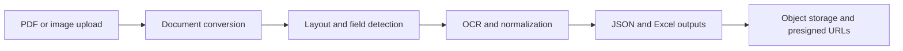

# BK_OCR - Financial Document OCR Service

Production-oriented OCR and table-extraction service for financial documents. The service combines YOLO-based detection, OCR post-processing, object storage, and API workflows to produce structured outputs for downstream analytics.

## Architecture



## Engineering highlights

- Flask API with health and document-processing endpoints.
- YOLO-based model loading with configurable model paths.
- OCR confidence and geometry controls through environment variables.
- MinIO-compatible object storage for inputs, crops, and generated outputs.
- Structured JSON and Excel artifacts for downstream financial workflows.
- Configuration separated from source code; credentials are never committed.

## Local setup

```bash
python -m venv .venv
source .venv/bin/activate  # Windows: .venv\Scripts\activate
pip install -r requirements.txt
cp .env.example .env      # Windows: copy .env.example .env
python run.py
```

The model weights are intentionally excluded from version control. Configure `MODEL_PATH` and `D_MODEL_PATH` with local or secured artifact paths.

## Security note

Use `.env.example` as the configuration contract and keep `.env` local. If a credential has ever been committed, revoke and rotate it before deployment.
